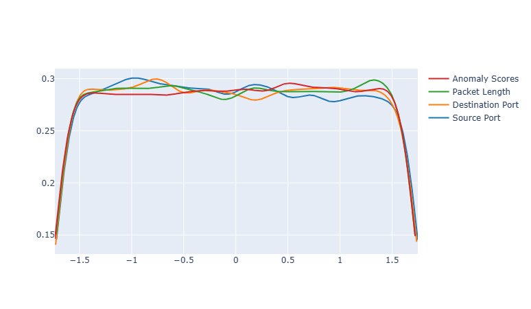
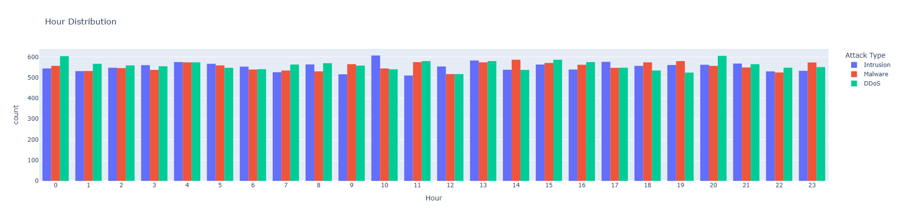
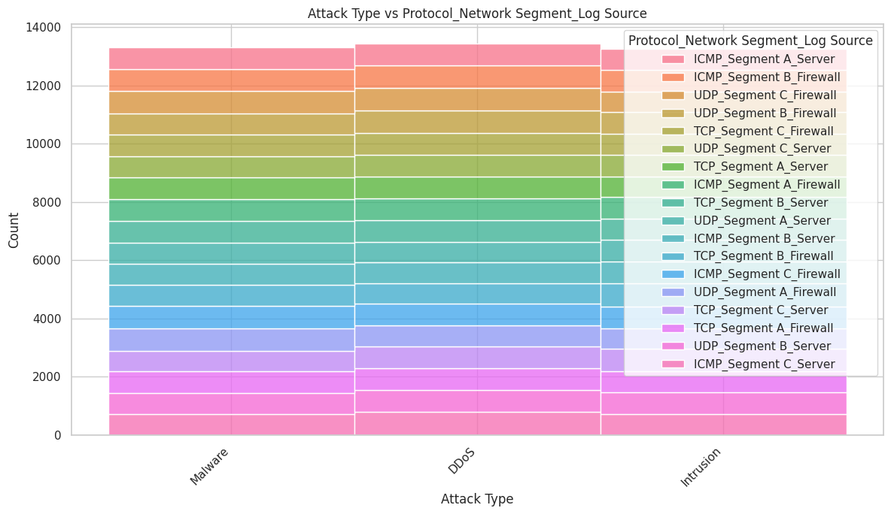
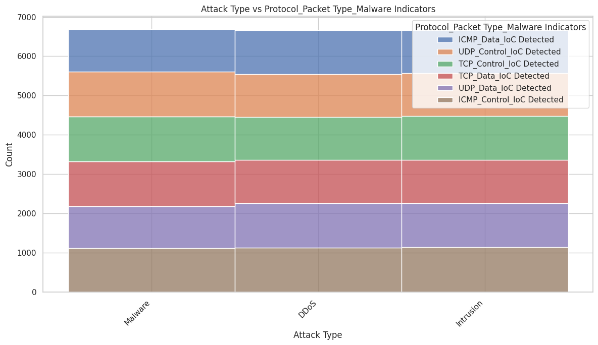
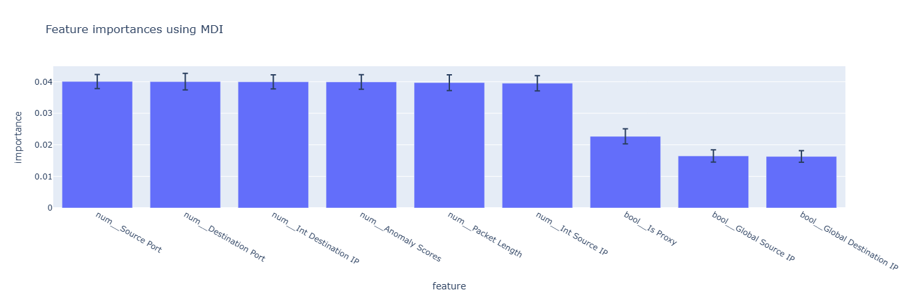

# Introduction

The report provide a detailed explanation of the work done as part of the project to develop a machine learning model to predict cyberattack.
The project is divided into 3 parts:
1. Data Analysis. The objective of the data analysis was to understand the dataset that will be used as input for our model.
2. Feature Engineering. All the features in the dataset may not be relevant or usable without some data extraction, data transformation and features crossing in order to provide more useful inputs.
3. Model design. Different type of ML model can be used to predict. In this part we explain what model we decided to use and how they compare to each other.

# Data Analysis

## Global Analysis

The dataset is composed of **40,000 observations** and **25 features**: 21 categorical/string, 3 integers (Source Port, Destination Port, Packet Length), and 1 float (Anomaly Scores).

The target variable **Attack Type** is perfectly balanced across three classes:

| Attack Type | Count  | Share   |
|-------------|--------|---------|
| DDoS        | 13,428 | 33.57%  |
| Malware     | 13,307 | 33.27%  |
| Intrusion   | 13,265 | 33.16%  |

#
 
About missing values, only 5 features are concerned and they are all detection related (Alerts/Warnings, IDS/IPS Alerts, Malware Indicators, Firewall Logs, Proxy Information) with around 50% missing each. This makes sense since not every attack will trigger every detection system. We filled them with 'None' before encoding.

#

To develop a machine learning model, it is neccesary to identify relationships between the output and the input dataset i.e if there are correlation between them.
The dataset show some correlation between features espacially data related to network information such as IPs, Ports.   

But in our case we are particularly looking at the correlation between the column attack type and the rest of the dataset. As shown by the image below, the correlation between each feature and the "attack type" is close to zero meaning there are no strong dependencies between the features and the type of attack.

 

To confirm it, we go into details for some features

## Feature Analysis

### Numerical Features

The four numerical features (Source Port, Destination Port, Packet Length, Anomaly Scores) follow near identical distributions across the three attack types. The KDE curves below show that all features approximate a uniform distribution, all values in the range are approximately equally likely to appear:

The three classes are statistically indistinguishable on any single numerical axis.

### Temporal Features

The Timestamp spans from January 2020 to October 2023. It was decomposed into Year, Month, Day, Hour, Minute, and Second, the chart below shows the attack count by hour of day for each attack type:

The three attack types follow virtually identical bar heights at every hour. Day attacks: **20,042** vs night attacks: **19958**, a difference of less than 0.5%, temporal features carry no predictive signal.

### Categorical Features

Even when combining features like Protocol × Network Segment × Log Source, the attack types reach the same total count for every combination:

The same observation applies to Protocol × Packet Type × Malware Indicators:

No categorical feature, individually or in combination, shows a systematic preference for any attack type. **Geo-location Data** (8723 unique values) was excluded from modeling due to too high cardinality.

## Dive into the data

Some features contain more information than they appear. We extracted more granular data from the following columns:

### Timestamp
Decomposed into Year, Month, Day, Hour, Minute and Second. As shown in the temporal analysis, none of these carry predictive signal.

### Device Information
The User-Agent string was parsed using the `user_agents` library to extract Browser Name, Browser Version, OS Family, OS Version, Device Type and Bot flag. All categories show an equal split across attack types.

### Source IP Address
All IPs are IPv4. Using RFC 1918 we checked which ones are private. Out of 40000 source IPs only 181 are private, we stored this as a binary feature.

### Source Port
Ports go from 1027 to 65535, no well known ports (0-1023) appear. We classified them as registered (< 49152, count: 30121) or ephemeral (>= 49152, count: 9879) and stored this as a binary feature.

## Component Analysis (FAMD and MCA)

To get a global view of the feature space we applied FAMD (Factor Analysis of Mixed Data), which is like PCA but for mixed numerical and categorical data. We excluded high cardinality columns first.

The results show that each component explains roughly the same share of variance (~16-17%). If there was structure in the data, the first components would dominate. This confirms there is nothing exploitable here.

We also ran MCA on categorical features alone and got the same result, all components explain ~6% of variance each, no categorical feature stands out.

Conclusion: There is no exploitable structure in the feature space, this sets a hard ceiling on what any model can achieve with this dataset.

# Feature Engineering

Since no raw feature is individually predictive, feature engineering focused on combining what we extracted above into a clean input for the model.

Columns with cardinality above 100 were excluded from direct encoding: Payload Data (40000 unique), Timestamp (39997), User Information (32389), Device Information (32104), Geo-location Data (8723). Payload Data was processed via TF-IDF (50 features) instead, the others were dropped.

# Model Development

## Baseline Models

Two baseline classifiers were trained on raw features using StandardScaler + OneHotEncoder + TF-IDF on Payload Data (80/20 stratified split, random_state=42):

| Model                            | Precision | Recall | F1   | Accuracy |
|----------------------------------|-----------|--------|------|----------|
| Random Forest (100 estimators)   | 0.33      | 0.33   | 0.33 | 32.76%   |
| HistGradientBoosting (200 iters) | 0.33      | 0.33   | 0.32 | 32.99%   |

Both models achieve accuracy equal to random chance (33.3%), confirming that raw features alone are insufficient for classification.

## Confusion Matrix Analysis

The HistGradientBoosting confusion matrix (test set, 8000 samples) reveals a systematic bias:

- **DDoS**: 1160 correct / 596 confused with Intrusion / 880 confused with Malware --> recall **44%**
- **Intrusion**: 1177 correct / 628 confused with DDoS / 916 confused with Malware --> recall **23%**
- **Malware**: 1163 correct / 629 confused with DDoS / 851 confused with Intrusion --> recall **33%**

The model over predicts DDoS and under predicts Intrusion, but this is a minor artefact, the overall accuracy remains at random chance level

## Feature Importance

The chart below shows the top features ranked by MDI (Mean Decrease in Impurity) from the Random Forest model:

All top features have similar importance scores, confirming that no single feature drives the predictions.

# Conclusion

This project built a complete end to end machine learning pipeline for cybersecurity attack type classification. The central challenge was the synthetic nature of the dataset all features are near randomly assigned with no meaningful correlation with Attack Type.

Key findings:

- **FAMD and MCA confirm no structure** : uniform variance spread across all components.
- **Categorical combinations carry no signal** : Protocol × Network Segment × Log Source and similar combinations show identical distributions across attack types.
- **Baseline models at ~33%** : equal to random chance, consistent across cross validation folds.
- **Feature importances are uniform** : no single feature dominates, all contribute at a similarly low level.
- **The dataset is the bottleneck** : tuning and feature engineering cannot compensate for absent signal.
