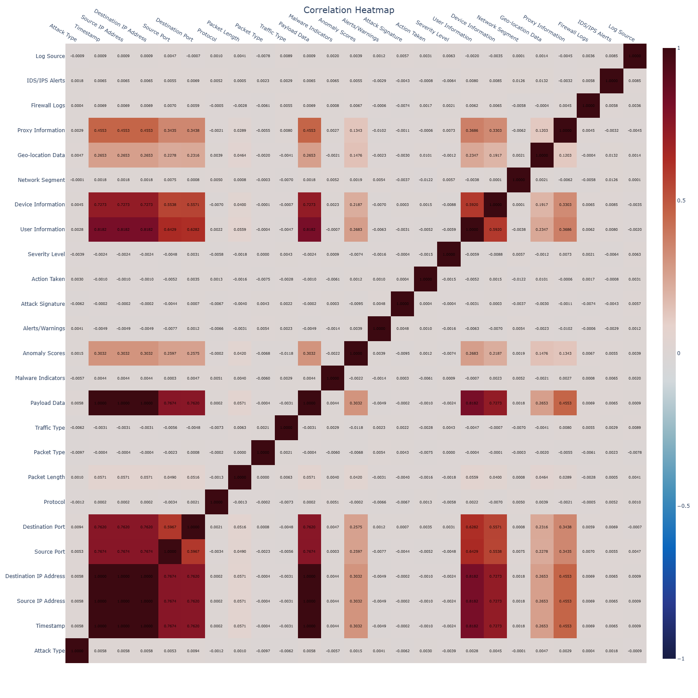
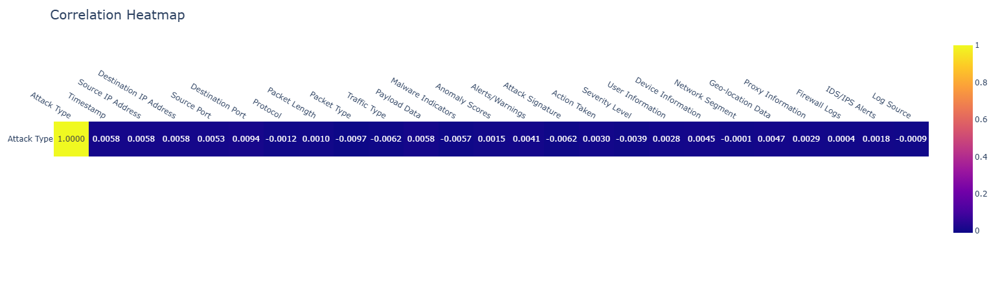

# Introduction

The report provide a detailed explanation of the work done as part of the project to develop a machine learning model to predict cyberattack.
The project is divided into 3 parts:
1. Data Analysis. The objective of the data analysis was to understand the dataset that will be used as input for our model.
2. Feature Engineering. All the features in the dataset may not be relevant or usable without some data extraction, data transformation and features crossing in order to provide more useful inputs.
3. Model design. Different type of ML model can be used to predict. In this part we explain what model we decided to use and how they compare to each other.

# Data Analysis

## Global Analysis

// Add some statistics such as count/unique and when relevant mean, median etc... 

To develop a machine learning model, it is neccesary to identify relationships between the output and the input dataset i.e if there are correlation between them.
The dataset show some correlation between features espacially data related to network information such as IPs, Ports.   
  
But in our case we are particularly looking at the correlation between the column attack type and the rest of the dataset. As shown by the image below, the correlation between each feature and the "attack type" is close to zero meaning there are no strong dependencies between the features and the type of attack.  
  
To confirm it, we go into details for some features

## Feature Analysis

#

## Dive into the data
Some features can be split into several columns in order to extract information. It the case of the feature "Timestamp" and "Device Information" for which more granular information can be extracted. For example, the device information contains information on the browser name, the browser version and sometimes the device used 

## Feature Engineering

## Model Development

